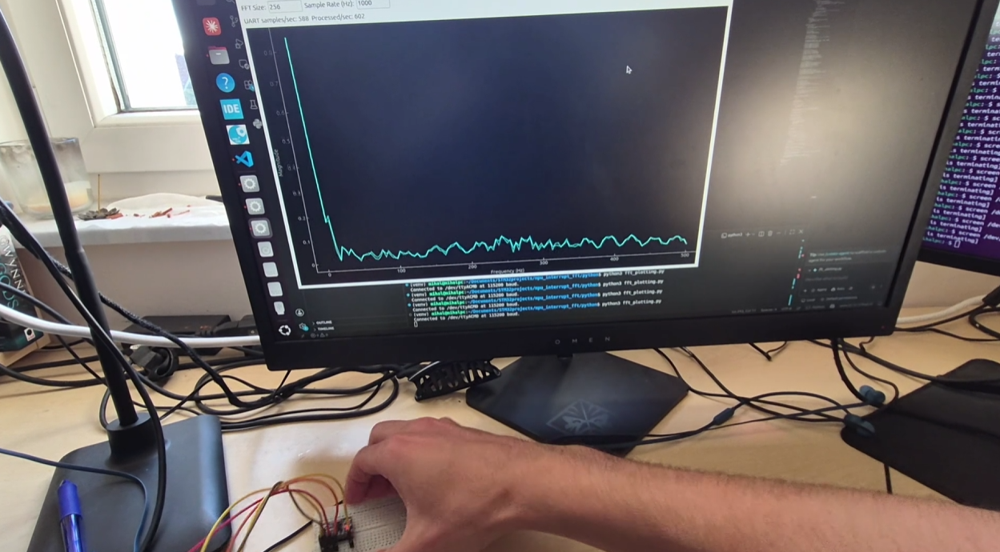

# Real time FFT analysis — STM32F446RE

Embedded vibration analysis on an STM32, performed on Accelerometer Z axis. 
Uses my own custom MPU-6050 driver (precise, hardware interrupt based polling): https://github.com/mihalamot/STM32-MPU6050-HAL-Driver
Streams sensor data over UART, python script performs FFT and displays magnitudes.

## Hardware
- STM32 Nucleo F446RE
- MPU-6050 

## Concepts
- I2C communication
- EXTI / hardware interrupt-driven sampling
- UART data streaming for real-time PC-side analysis
- FFT vibration analysis (NumPy) 

## Third party
- ST HAL drivers (ST License)
- FreeRTOS (CMSIS-RTOS2 API)
- NumPy, PyQt6, pyqtgraph, pyserial 

## Showcase video
   
